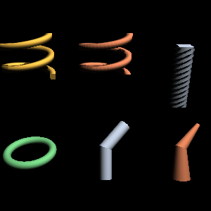
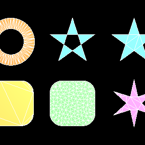

# opengl_extrusions

Tubing, extrusion, lathing and polygon tessellation, as NumPy arrays.

Give it a 2D outline and a path, and it hands back the vertex arrays for the
surface that outline sweeps out — positions, normals, texture coordinates,
tangents and an index buffer, named the way glTF names them.

```python
from opengl_extrusions import extrude, circle

pipe = extrude(circle(radius=0.1, sides=16),
               path=[(0, 0, 0), (0, 0, 1), (1, 0, 2)])

pipe.primitives[0].positions      # (V, 3) float32, C-contiguous
pipe.primitives[0].indices        # (T*3,) uint32
```

The default frame orients the contour against a fixed `up=(0, 1, 0)`, which has
nothing to align to where the path runs straight up. For a path that may point
anywhere — a vertical mast, a cable, a loop — ask for the rotation-minimizing
frame instead:

```python
mast = extrude(circle(radius=0.1, sides=16),
               path=[(0, 0, 0), (0, 1, 0), (0, 2, 0)],
               frames='rmf')
```



*Lathe, spiral, screw, toroid, polycylinder and polycone — every named shape,
generated here and drawn by OpenGLContext in a core profile.*

## What it makes

| Call | Shape |
|---|---|
| `extrude(contour, path)` | any outline swept along any path |
| `polycylinder(path, radius)` | a round tube of constant radius |
| `polycone(path, radii)` | a tube whose radius is given at every point |
| `lathe(contour, …)` | swept about the z axis, contour plane staying radial |
| `spiral(contour, …)` | swept along a helix, contour plane square to the path |
| `screw(contour, …)` | extruded along z while turning |
| `helicoid(…)`, `toroid(…)` | the two above with a circular section |
| `vrml97_extrusion(…)` | VRML97's `Extrusion` node, to its specification |
| `tessellate(contours)` | 2D outlines into triangles — useful on its own |

Sweeps take corners four ways (`raw`, `angle`, `cut`, `round`), shade three ways
(`facet`, `edge`, `path_edge`), cap either end, close into a loop, taper, twist,
take per-point colour, and follow splines sampled to a curvature tolerance.

## The tessellator

`tessellate()` turns 2D outlines into triangles and is a public API in its own
right — font glyphs, filled faces, floor plans, map polygons. It is a
**constrained Delaunay triangulation** with exact-sign predicates, so it handles
outlines that cross themselves, holes, coincident vertices and T-junctions, and
the triangles it produces have the largest smallest angle the outline allows.



*Holes, winding rules, and refinement to an area or an angle target — the white
lines are the triangle edges.*

```python
from opengl_extrusions import tessellate

result = tessellate([outer_ring, hole_ring], winding='odd', min_angle=30.0)
result.points        # (V, 2)
result.triangles     # (T, 3), counter-clockwise
```

See [docs/TESSELLATION.md](docs/TESSELLATION.md).

## Install

```bash
pip install opengl_extrusions
```

**NumPy is the only runtime dependency.** The code is Python and NumPy with one
exception: the geometric predicates' inner loop is also built as a small Cython
extension. Published wheels carry it. Building from source needs Cython, which
pip installs for the build; where there is no C compiler the extension is
skipped and the pure-Python implementation of the same predicates is used, and
everything behaves identically — the two are required to produce the same
triangles, and the test suite runs both on every supported Python.
`opengl_extrusions.predicates.ACCELERATED` says which is in use;
`OPENGL_EXTRUSIONS_NO_ACCEL=1` forces the pure path.

The optional `gle` extra, which only the parity tests use, pins a pre-release of
PyOpenGL, so it needs `pip install --pre 'opengl_extrusions[gle]'`.

## Documentation

- [docs/API.md](docs/API.md) — every entry point, every parameter, units and limits
- [docs/TESSELLATION.md](docs/TESSELLATION.md) — the tessellator, in detail
- [docs/CURVES.md](docs/CURVES.md) — splines and adaptive sampling
- [docs/GLE-PARITY.md](docs/GLE-PARITY.md) — how this compares to the GLE tubing library
- [specs/SPEC-GLE-GEOMETRY.md](specs/SPEC-GLE-GEOMETRY.md) — the measured facts the GLE parity rests on
- [specs/SPEC-VRML97-EXTRUSION.md](specs/SPEC-VRML97-EXTRUSION.md) — the ISO/IEC 14772-1 clauses the `Extrusion` node is built from

## Design

**glTF is the vocabulary, not the container.** Attributes are called `POSITION`,
`NORMAL`, `TEXCOORD_0` and stored in the types glTF stores them in, but they are
plain NumPy arrays rather than accessors into a blob. Almost nothing that
generates geometry goes on to write a file, and a caller who had to decode an
accessor to reach a vertex would be worse off than one handed the array.
`to_gltf()` and `to_glb()` exist for the cases that do want a file.

**The arrays are ready to upload, in the form a glTF renderer already uses.**
C-contiguous `float32` attributes, `uint32` indices — which is not a coincidence
but the point: it is the same arrangement OpenGLContext's `PBRMesh` holds, the
node its glTF loader builds for every primitive of every `.glb` it reads. A mesh
generated here and a mesh decoded from a file reach the renderer
indistinguishable from one another, and handing one over costs nothing because
there is nothing left to convert:

```python
from OpenGLContext.scenegraph.pbrmesh import PBRMesh
node = PBRMesh(**pipe.primitives[0].arrays())      # no copy: shares memory
```

Those are the types a GL vertex buffer wants in any case, so `glBufferData`
takes them directly whether or not OpenGLContext is anywhere nearby.

**Exact where it matters.** Every geometric decision in the tessellator goes
through orientation and in-circle predicates that return an exact sign — a
floating-point determinant answers "collinear" for points that are not, and a
triangulation built on that answer is not a triangulation.

## Licence

MIT. See [LICENSE](LICENSE).
