# API

Everything takes its parameters by keyword and returns a `Mesh`. There are no
callbacks and no state to set beforehand: what a shape is, is what you passed in.

**Angles are radians. Lengths are in whatever unit your world uses.**

## How a sweep is built

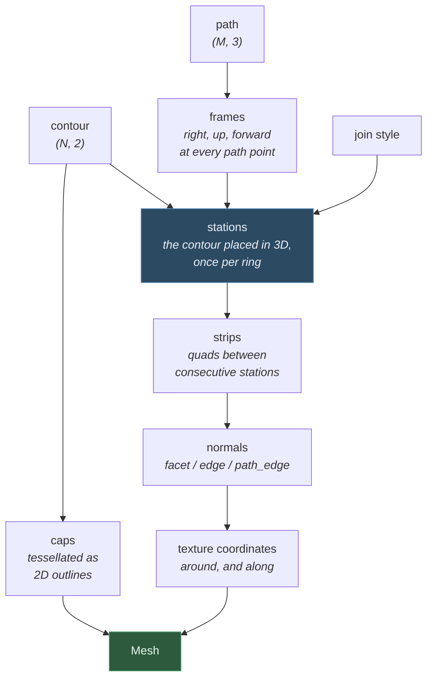

A **station** is one ring of contour points placed in 3D. A straight run of path
gives one station per point; a corner gives one, two or several depending on the
join style. Consecutive stations are joined by a strip of quads.

## `extrude(contour, path, **options)`

The general sweep. Every other generator is this with its parameters worked out.

| Parameter | Default | What it does |
|---|---|---|
| `contour` | — | `(N, 2)` outline, or a list of them for a shape with holes: outer ring counter-clockwise, each hole clockwise |
| `path` | — | `(M, 3)` points to sweep along; consecutive duplicates are dropped |
| `contour_normals` | computed | `(N, 2)` outward normals; supply them when you know the true ones |
| `up` | `(0, 1, 0)` | which way is up for the contour as it travels |
| `frames` | `'up'` | `'up'` keeps the contour aligned to `up`; `'rmf'` carries it along the path with no reference direction |
| `join` | `'angle'` | `'raw'`, `'angle'`, `'cut'`, `'round'` |
| `miter_limit` | `4.0` | how far a mitre may stretch before the corner bevels instead |
| `round_segments` | `4` | facets in a `'round'` join |
| `caps` | `'auto'` | `'auto'`, `True`, `False`, `'begin'`, `'end'`, `'both'` |
| `closed_contour` | `True` | whether the outline's last point joins its first |
| `closed_path` | `False` | whether the path loops, giving a shape with no ends |
| `normals` | `'edge'` | `'facet'`, `'edge'`, `'path_edge'` |
| `texture` | `'normalized'` | `'normalized'` (0..1), `'arc_length'` (model units), one of the twelve generated modes below, or `None` |
| `scale` | `1` | contour size: one number, an `(x, y)` pair, or one of either per path point |
| `twist` | `0` | rotation about the path in radians, one value or one per point |
| `color` | none | vertex colour, `(r, g, b)` or `(r, g, b, a)`, one or one per point |
| `cap_min_angle`, `cap_max_area` | none | refine the end caps |
| `name` | none | a name for the mesh |

### Frames: `'up'` versus `'rmf'`

`'up'` keeps each frame's up as near one fixed direction as it can. Simple and
predictable, and what you want for anything with a real up — a road, a railing,
an extruded sign. Its failure is built in: where the path runs *parallel* to the
reference direction there is nothing left to align to, and `extrude` raises
rather than producing a frame that spins.

`'rmf'` carries each frame from the one before it by the smallest rotation that
turns the old direction onto the new one. There is no reference direction, so
there is no direction that breaks it, and the contour never spins about the path
except where the path itself twists. Use it for a cable, a knot, a loop, or any
path that might point anywhere.

### Join styles

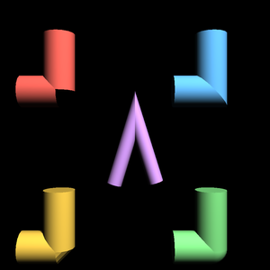

Clockwise from top left: `raw` (the runs come apart), `angle` (a mitre, the
default — the diagonal seam is where its two surfaces meet), `round` (an elbow,
the tube turned through the bend) and `cut` (a bevel, one flat band between two
square ends). The purple hairpin in the middle is a mitre at a corner sharp
enough that the limit turns it into a bevel — without one, the outside of a
nearly-reversed corner stretches away to a spike.

### Texture coordinates

Two families. The **parameter** modes describe the sweep itself:
`'normalized'` runs 0..1 around the contour and along the path, and
`'arc_length'` uses model units for both so a texture tiles at a fixed size
however long the extrusion is.

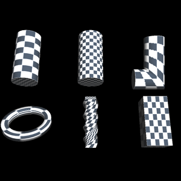

*The same checkerboard on six sweeps. A tube under `normalized` and under
`arc_length` — the second repeats at a fixed size rather than stretching to the
length; an elbow, where the checks follow the bend; a lathe, a screw, and a
VRML97 `Extrusion`. Where the squares stretch is where the mapping stretches.*

The **generated** modes are the twelve the GLE tubing library offers, kept so a
caller porting from it gets the same mapping. Each combines one of four inputs
with one of three projections:

| | after scale/twist | before scale/twist |
|---|---|---|
| the vertex | `vertex_flat`, `vertex_cyl`, `vertex_sph` | `vertex_model_flat`, `vertex_model_cyl`, `vertex_model_sph` |
| the surface normal | `normal_flat`, `normal_cyl`, `normal_sph` | `normal_model_flat`, `normal_model_cyl`, `normal_model_sph` |

| projection | u | v |
|---|---|---|
| `flat` | the input's x | distance along the path |
| `cyl` | ¾ − atan2(y, x) / 2π | distance along the path |
| `sph` | ¾ − atan2(y, x) / 2π | 1 − arccos(z / ‖p‖) / π |

Coordinates are read in the **segment's own frame**, where the contour lies in
the x-y plane and the path runs along −z, so `z` is the negative of the distance
travelled. The `model` variants read the contour *before* its per-point scale
and twist, which keeps a texture still on a shape that tapers or turns as it is
swept instead of letting it slide as the section changes.

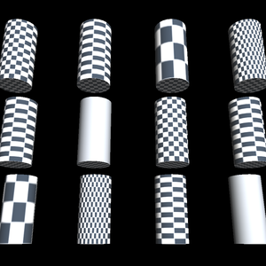

*All twelve on one tube, reading left to right and top to bottom in the order
listed above. Two come out plain: `normal_sph` and `normal_model_sph` give a
constant v on a straight tube, because its normals all lie in the contour plane,
so the whole surface samples one row of the texture. That is what those modes
do, and why they are for swept balls and elbows rather than for pipes.*

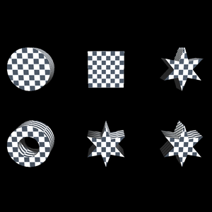

*End caps are mapped from the outline's own bounding box, so a texture lies flat
across the face whatever its shape: a round cap, a square one, a star, and one
with a hole in it. The last two are the same star refined by area and by angle —
refinement adds vertices but does not move the mapping.*

**A cap's coordinates run 0..1 whatever `texture` mode was asked for**, because a
cap has no "along the path" to measure and a flat face wants its own square of
the texture. Cap and side coordinates are therefore in different spaces, and a
texture that continues across the rim is not something this produces. Where you
need one, texture the sides and the caps as separate primitives — build the sweep
with `caps=False` and tessellate the outline yourself.

These formulae were established by measuring what GLE emits, not by reading its
source — see [GLE-PARITY.md](GLE-PARITY.md) and
[SPEC-GLE-GEOMETRY.md](../specs/SPEC-GLE-GEOMETRY.md). Two things to know:

- **u may fall outside 0..1.** The angular modes land in [0.25, 1.25), which is
  where GLE puts them; `GL_REPEAT` handles it, and shifting the range would move
  the mapping relative to GLE's.
- **The seam is a step, not a wrap.** GLE emits the contour's seam vertex twice,
  at u=0 and u=1, so a texture crosses it smoothly. Here that vertex is shared
  between the quads either side and carries one coordinate, so u steps back
  across the seam. Use a parameter mode where that matters.

### Contours

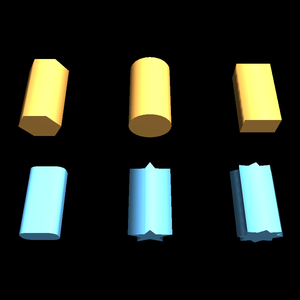

*The built-in outlines, each swept along the same straight path so only the
contour differs: `circle` with 6 and with 24 sides, `rectangle`,
`rounded_rectangle`, and `star` with 5 points and with 8 blunter ones.*

### Caps

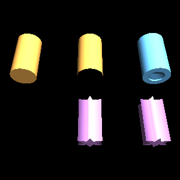

*Top: `caps=True`, `caps=False` (you can see through it), and a contour with a
hole — the cap has the hole in it, because caps are tessellated rather than
fanned. Bottom: `closed_contour=False`, which makes a sheet with no inside and
therefore no cap at all; then the same star-section cap refined to
`cap_max_area` of 0.004 and of 0.05.*

### Scale, twist and colour

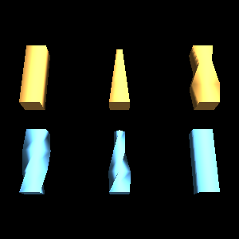

*All on the same straight path, so only the per-point parameters differ. Top: no
options; `scale` from 1 down to 0.3; and a `scale` whose x and y differ, so the
section changes proportions as it travels. Bottom: `twist` to π/2; twist and
taper together; and a per-point `color`.*

### Normal modes

A normal mode moves no vertex. It decides only which way the surface is said to
face, and therefore what it looks like under a light.

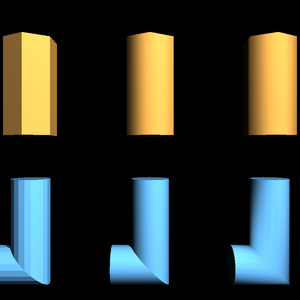

*Left to right in each row: `facet`, `edge`, `path_edge`. Top, a hexagonal tube
— `facet` gives six flat faces and six hard edges, `edge` blends them so a
six-sided tube shades like a cylinder while its silhouette stays a hexagon, and
on a straight run `path_edge` has nothing further to smooth. Bottom, a round
tube round a corner — `facet` reads as a stack of rings, `edge` stays smooth
around the tube and creased at the corner, and `path_edge` rounds the corner off
visually as well.*

| Mode | Surface | Reach for it when |
|---|---|---|
| `facet` | every face flat, every edge hard | the facets are the point — a hex bolt, a crystal, a cut gem |
| `edge` | smooth around the contour, creased across each ring | a hexagonal tube that should shade like a cylinder; a mitred pipe joint whose corner should stay a corner |
| `path_edge` | smooth both ways | anything bending smoothly — a cable, a hose, a handrail |

**`edge` is the default and usually the right answer**: it keeps the outline's
curves smooth and the path's corners sharp, which is what most swept shapes
mean.

`path_edge` averages the two normals a shared ring carries — the one the
surface arrives at the corner with and the one it leaves with — and welds on the
result, so a bend shades as a curve. On a straight run there is nothing to
average and it produces what `edge` does.

The same averaging is available on its own, for a mesh assembled from pieces or
one whose creases you want to choose after the fact:

```python
smooth = mesh.smoothed(crease_angle=numpy.pi)     # every seam
partial = mesh.smoothed(crease_angle=numpy.radians(45))
```

A seam whose two normals differ by less than `crease_angle` radians is averaged
into one; a sharper one is left alone. Zero changes nothing, `pi` or more smooths
every seam there is.

The OpenGLContext repository has a viewer for comparing the three side by side,
at `openglcontext/tests/extrusions_normals.py` — a different repository from
this one.

## Rotational sweeps

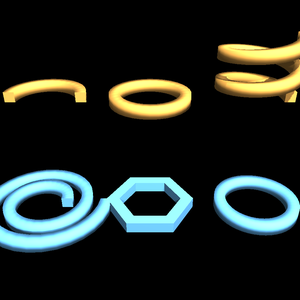

*What each of a lathe's parameters does, on one square section. Top:
`sweep_angle` of π and of 2π, then `delta_z=0.6` over two turns — a rising coil.
Bottom: `delta_radius=0.4`, which spirals outward instead; `sides=6`, a
hexagonal ring; and `sides=48`, a smooth one.*

`lathe` and `spiral` both carry a contour around the z axis. The difference is
what the contour's own plane does on the way, and it is visible the moment the
sweep climbs:

| | `lathe` | `spiral` |
|---|---|---|
| The contour's plane | stays **radial** — always contains the z axis | stays **square to the path** — tilts with the climb |
| Every cross-section at a constant angle is | the contour, undistorted | a stretched contour |
| Every cross-section across the sweep is | a sheared contour | the contour, undistorted |
| So it is the shape of | a screw thread, a spiral ramp | a coiled spring, a wound cable |

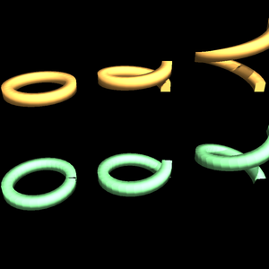

*The same parameters both ways, as the climb steepens. Top row `lathe`, bottom
row `spiral`; left to right `delta_z` of 0, 0.5 and 1.4 over one turn. Flat, the
two are identical. The steeper the climb, the further apart they get: the lathe's
section stays upright while the spiral's tilts with the path.*

For a flat sweep the two are identical. Both read the contour in the **r-z
plane**: x is distance out from the axis, added to the sweep radius, and y is
height.

| Parameter | Default | What it does |
|---|---|---|
| `start_radius` | `1.0` | distance from the axis at `start_angle` |
| `delta_radius` | `0.0` | change in that radius per full turn |
| `start_z` | `0.0` | height at `start_angle` |
| `delta_z` | `0.0` | rise per full turn — the pitch |
| `start_angle` | `0.0` | where it begins |
| `sweep_angle` | `2π` | how far it goes; may exceed a turn |
| `sides` | `20` | facets per full turn |
| `caps` | `'auto'` | cap the cut ends unless the sweep closes on itself, or the contour is open |
| `mitre` | `True` (lathe) | stretch each ring so consecutive facets meet cleanly |

`helicoid(section_radius, …)` is `lathe` of a circle; `toroid(section_radius, …)`
is `spiral` of one, which with the default full turn is a torus.

## `screw(contour, start_z, end_z, twist, …)`

A contour extruded along z while turning. `steps` chooses how many rings; left
out, enough for a smooth twist are worked out from how much turning there is.

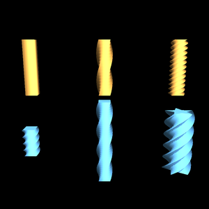

*Top: `twist` of 0 (a plain bar), π (a half turn) and 6π (a threaded rod), all
of the same square section over the same length. Bottom: the same twist of 2π
over a short `start_z`..`end_z` and over a long one — the pitch changes with the
length, not with the twist — and a five-pointed star section, which is what makes
an auger.*

## `polycylinder(path, radius, …)` and `polycone(path, radii, …)`

Round tubes along a path — constant radius, or a radius given at every point so
each segment is a cone frustum. Both take everything `extrude` takes.

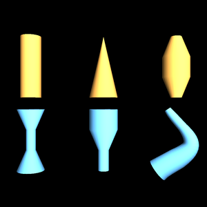

*What a per-point radius buys you. Top: a constant radius (which is
`polycylinder`), a taper to nothing, and a barrel. Bottom: a waist, a stepped
profile, and a taper following a curved path. The path is the same straight line
in all but the last; only the radii differ.*

## `vrml97_extrusion(cross_section, spine, …)`

VRML97's `Extrusion` node, to ISO/IEC 14772-1:1997 clause 6.23.

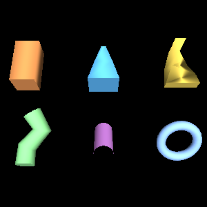

The cross-section is read in the **x-z** plane, as the specification writes it,
and is oriented by the specification's Spine-aligned Cross-section Plane — axes
taken from the spine's own neighbours rather than from any reference direction.
A `cross_section` or `spine` whose last point repeats its first is *closed*.

**Wind the cross-section clockwise.** In the x-z plane the outward order is
clockwise — which is why VRML97's own default cross-section is clockwise there,
with `ccw` still `TRUE`. The contour builders here wind *counter*-clockwise,
because that is the outward order in the x-y plane `extrude` sweeps in, so
reverse one before handing it to this function:

```python
vrml97_extrusion(cross_section=circle(0.3, 16)[::-1], spine=spine)
```

A counter-clockwise cross-section is accepted and gives the same solid turned
inside out — consistently, sides and caps together.

| Parameter | Default |
|---|---|
| `scale` | one `(x, y)` for all, or one per spine point; every component positive |
| `orientation` | axis-angle `(x, y, z, radians)`, one or one per point |
| `begin_cap`, `end_cap` | `True`; ignored for a closed spine, which has no ends |
| `ccw` | `True` — which way the surface faces |
| `crease_angle` | `0.0` — see below |

`crease_angle` is in radians, and is a threshold rather than a switch: an edge
whose two faces meet at less than it is shaded smoothly across, and one that
meets at more keeps its lighting discontinuity. The normals are generated from
the faces, as ISO/IEC 14772-1 clause 6.23 requires, so **the default of `0.0`
gives a faceted surface** — which is what VRML97's own default asks for. `pi` or
more smooths every edge there is. See
[specs/SPEC-VRML97-EXTRUSION.md](../specs/SPEC-VRML97-EXTRUSION.md) for which
clauses this node is built from.

## Curves


`catmull_rom`, `bezier` and `bspline` produce paths to sweep along; `helix`
produces the one the rotational sweeps use. Give `tolerance` for **adaptive
sampling** — the greatest distance the straight line between two samples may
stray from the true curve — and the samples land where the curvature is rather
than being spread evenly. Halving it roughly doubles the samples in the curved
parts and leaves the straight parts alone.

See [CURVES.md](CURVES.md).

## NURBS surfaces

`surface_grid(control, u_knots, v_knots, u_degree, v_degree, u_steps, v_steps,
weights=None)` evaluates a NURBS surface to a mesh: positions, normals,
parametric texture coordinates and triangle indices.

```python
from opengl_extrusions import surface_grid

mesh = surface_grid(control, u_knots, v_knots, 3, 3, u_steps=32, v_steps=32)
```

`control` is a `(u, v, 3)` grid of control points; each knot vector holds
`len(control_axis) + degree + 1` non-decreasing values. `weights` is one
positive number per control point --- the *rational* in NURBS, and what lets a
NURBS circle be a circle rather than an approximation of one. Equal weights give
the same surface as none.

The normals come from the surface's own first derivatives rather than from
differences between neighbouring samples, so they are right at the edges of a
patch as well as in the middle. Where the surface is degenerate --- a collapsed
row of control points, as a cone tip or a teapot's lid --- the two tangents are
parallel and their cross product vanishes; the normal there is read as the limit
a step into the domain away.

For parameters that are not a grid --- the vertices of a trimmed domain, say ---
`surface_at(control, u_knots, v_knots, u_degree, v_degree, uv, weights=None)`
and `normals_at(...)` take an `(N, 2)` array of pairs. `curve_points(control,
knots, degree, ts, weights=None)` is the one-dimensional case, for control
polygons of any component count: a trimming curve's components are `(u, v)`
rather than a position.

`basis_functions(parameters, knots, degree, count)` and `basis_derivatives(...)`
are the basis itself, a row per parameter, for a caller building something these
functions do not cover.

## What comes back

`Mesh` holds a list of `Primitive`, each holding NumPy arrays keyed by glTF
attribute name.

```python
mesh.primitives[0].positions  # (V, 3) float32, C-contiguous
mesh.primitives[0].normals  # (V, 3)
mesh.primitives[0].texcoords  # (V, 2)
mesh.primitives[0].indices  # (T*3,) uint32
mesh.primitives[0].attributes  # the same, under their glTF names
mesh.primitives[0].arrays()  # under a renderer's keyword names
```

### The form OpenGLContext's glTF renderer works in

A `Primitive` holds the same arrangement of arrays as OpenGLContext's
[`PBRMesh`](https://github.com/mcfletch/openglcontext), the node its glTF loader
builds for every primitive of every `.glb` it loads: the same attribute names,
component types, index type and memory layout.

```python
from OpenGLContext.scenegraph.pbrmesh import PBRMesh

node = PBRMesh(**mesh.primitives[0].arrays())
```

`arrays()` renames the glTF semantics to the keywords `PBRMesh.__init__` takes.

| Here | `PBRMesh` keyword |
|---|---|
| `POSITION` | `positions` |
| `NORMAL` | `normals` |
| `TEXCOORD_0`, `TEXCOORD_1` | `texcoords`, `texcoords1` |
| `TANGENT` | `tangents` |
| `COLOR_0` | `colors` |
| `indices` | `indices` |
| `mode` | `draw_mode` |

Nothing is copied on the way. `PBRMesh` normalises what it is given with
`asarray(..., float32)` and `ascontiguousarray`, and its indices with
`asarray(..., uint32)`, each a no-op on an array that already holds that dtype
and layout — which is why the generators here emit C-contiguous `float32`
attributes and `uint32` indices: the array the generator filled is the array the
VBO uploads. OpenGLContext's `test_the_arrays_are_handed_over_without_copying`
covers it.

Those are the types a GL vertex buffer takes in any case, so `glBufferData`
accepts them directly with or without OpenGLContext.

| Method | What it does |
|---|---|
| `mesh.validate()` | raise unless every primitive can actually be drawn |
| `mesh.merged()` | concatenate primitives that share a layout — one draw call |
| `mesh.welded()` | merge duplicate vertices; a hard edge stays hard |
| `mesh.transformed(matrix)` | move it, normals through the inverse transpose |
| `mesh.reversed()` | turn it inside out |
| `mesh.bounds` | `(minimum, maximum)` corner |
| `primitive.is_watertight()` | whether the surface is closed |
| `primitive.signed_volume()` | what it encloses; negative means inside out |
| `primitive.surface_area()` | total area |
| `mesh.smoothed(crease_angle)` | average the normals of seams shallower than the angle, then weld |
| `mesh.to_gltf()`, `mesh.to_glb(path)`, `mesh.to_glb_bytes()` | serialise |

`to_gltf()` returns a glTF 2.0 document and nothing else — every key in it is one
the specification defines. `primitive.material` indexes `mesh.materials`; a mesh
that leaves `materials` empty and uses the index only to group its primitives
gets default PBR materials written for it, and one that supplies materials gets a
`MeshError` for an index outside them.

And, from `opengl_extrusions.tangents`:

| Function | What it does |
|---|---|
| `with_tangents(mesh)` | add glTF `TANGENT`, for normal mapping |
| `levels_of_detail(generator, levels, **parameters)` | the same shape, progressively coarser |
| `to_collider(mesh)` | a `Collider`: welded positions and indices for a physics engine, plus `watertight` and `volume` |

## Errors

| Raised | When |
|---|---|
| `SweepError` | a path of fewer than two distinct points; caps asked for where they cannot be built |
| `FrameError` | a path parallel to `up` under `frames='up'` |
| `CurveError` | too few control points, a non-positive tolerance |
| `NurbsError` | a knot vector that does not match the control net, a degree the net is too small for, a non-positive weight, a grid of fewer than two steps |
| `MeshError` | a mesh that could not be drawn — mismatched attributes, an index out of range, vertices with no triangles, a singular transform, a material index nothing defines |
| `TriangulationError` | a constraint crossing another constraint |
| `NonFinitePointError` | a NaN or an infinity anywhere |
| `ValueError` | everything else malformed; all of the above are subclasses of it or of `RuntimeError` |

Degenerate-but-meaningful input does **not** raise: repeated path points are
dropped, a zero-radius contour produces a surface with no area, a ring with too
few points is skipped rather than costing you the other eleven.
