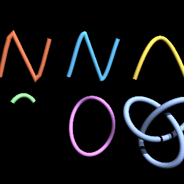
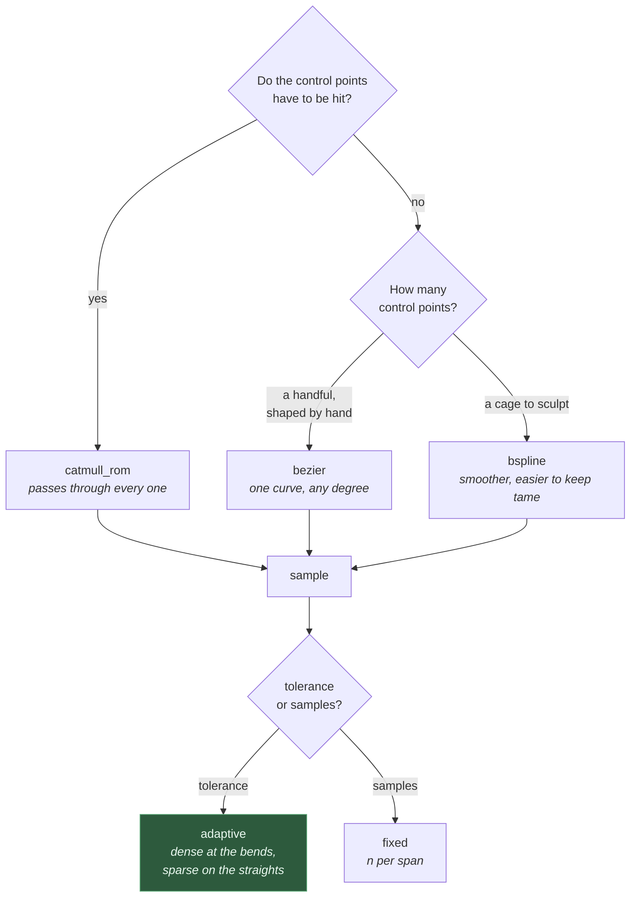
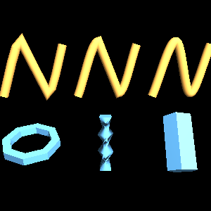

# Curves and adaptive sampling

A path given as a list of points is a decision already made: how many points,
and where. These let you give the *curve* and have the sampling chosen for it.



*Top: a Catmull-Rom sampled coarsely and finely through the same waypoints, then
a Bézier. Bottom: a B-spline, a loop that runs through the vertical, and a
trefoil knot swept as a closed path.*

## Which curve



`catmull_rom` is the one to reach for when the control points are positions
something must actually go through — waypoints, a drawn path, a camera track.
`bezier` and `bspline` treat their points as a cage that pulls the curve about
without being touched by it.

## Adaptive sampling

`tolerance` is the greatest distance the straight line between two samples may
stray from the true curve, in model units. The interval is bisected wherever
that distance is exceeded at the midpoint, so the samples end up where the
curvature is — which is the cheapest place to spend them.

```python
from opengl_extrusions import catmull_rom, extrude, circle

waypoints = [(0, 0, 0), (2, 1, 0), (4, 0, 1), (6, 2, 1)]
path = catmull_rom(waypoints, tolerance=1e-3)
mesh = extrude(circle(0.2, 12), path, frames='rmf')
```

Halving the tolerance roughly doubles the samples in the curved parts and leaves
the straight parts alone. That is the whole point: a road with two hairpins and
a mile of straight should not pay for the hairpins over the whole mile.



*Top: one spline swept at chord-error tolerances of 0.08, 0.01 and 0.0005 — the
facets you can see **are** the samples, and they crowd into the bends rather
than spreading evenly. Bottom: the parameters that play the same role elsewhere
— a lathe's `sides` per turn, a screw's `steps`, and a contour's own `sides`.
Each is the same trade: how much silhouette error you will accept for how many
triangles.*

`sample_adaptive(evaluate, tolerance=...)` applies the same treatment to any
function of one parameter, curve or not.

## Sampling something else

| Function | What it does |
|---|---|
| `helix(...)` | points along a helix about z; what the rotational sweeps use |
| `arc_lengths(points)` | cumulative distance along a polyline |
| `resample_uniform(points, spacing)` | re-space a polyline evenly along itself, shape unchanged |

`resample_uniform` is worth knowing about: it does not change the shape, only
where the samples sit. Useful before texturing by index, or for a sweep whose
rings should be evenly spread however the path was authored.

## Closed paths and vertical paths

Two things a hand-written point list makes awkward, and these make easy:

**A loop.** `closed_path=True` joins the last point to the first with a proper
join and matching frames — a torus, a ring seal, a racetrack barrier. There are
no ends, so there are no caps to put on them.

**Straight up.** A frame kept aligned to a fixed `up` has nothing left to align
to where the path runs parallel to it, and `frames='up'` raises rather than
producing a frame that spins. `frames='rmf'` has no reference direction and no
such failure — which is why the loop and the knot above both use it.

## Bounds

- Adaptive sampling bisects at most `MAX_SUBDIVISION` (12) levels deep per span,
  so a pathological curve yields a few thousand points rather than running away.
- A B-spline needs more control points than its degree.
- A Bézier needs at least two.
- Non-finite control points raise `CurveError`.
