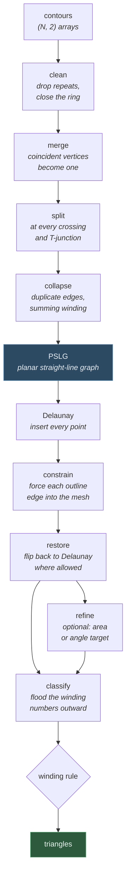
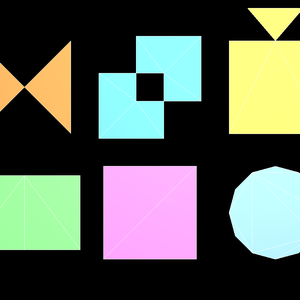
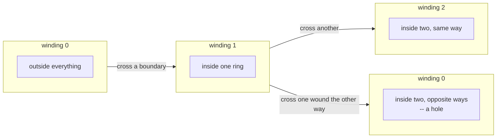

# Tessellation

Turning 2D outlines into triangles. This is a general-purpose tessellator: it
was written for extrusion end caps, but nothing about it is specific to them.
Font glyphs, filled faces, floor plans, map polygons — anything given as an
outline and wanted as a mesh.

```python
from opengl_extrusions import tessellate

result = tessellate([outer, hole], winding='odd')
result.points  # (V, 2) float64
result.triangles  # (T, 3) int32, counter-clockwise
result.source_index  # (V,) where each vertex came from in the input, or -1
```

## What happens to an outline



Everything before the `PSLG` box is about making the input *planar*, which is
what a constrained triangulation needs and what almost no real input is.
Everything after it is the triangulation itself.

## Preprocessing: the part that makes real input work

A triangulator needs vertices that are distinct, edges that meet only at shared
endpoints, and no vertex sitting in the middle of somebody else's edge. Real
outlines are not like that.

| What arrives | What is done about it |
|---|---|
| The first point repeated at the end | Dropped; the ring closes implicitly |
| Two points the same, or nearly | Merged, at a tolerance scaled to the input's size |
| An outline crossing itself | Split at the crossing, which becomes a new vertex |
| Two outlines crossing | Both split, at the same new vertex |
| A vertex on another outline's edge | That edge is split there — a T-junction, which a triangulation cannot leave alone |
| Two shapes sharing an edge, opposite ways | The shared edge carries no winding change, so it is not a boundary and the two become one region |
| A ring with no area | Skipped; the other rings are unaffected |
| A NaN or an infinity | Refused, with an exception |



*Each of these would defeat a triangulator taken literally, and what the
preprocessing makes of it. Top: an outline crossing itself, split at the
crossing, with the doubly-wound middle left empty by the odd rule; two rings
crossing, both split at both points, their overlap empty for the same reason; a
T-junction, where one shape's corner lands on another's edge and that edge is
split there. Bottom: two shapes butted together and wound alike, whose shared
stretch carries no winding change and so is not a boundary at all — they come
out as one region; near-duplicate vertices merged rather than left as a sliver;
and a ring closed by repeating its first point, which is dropped.*

The splitting repeats until nothing changes, because rounding a computed
crossing onto the vertex grid can in principle nudge a segment across a
neighbour it previously missed.

## Winding rules

Which parts come out solid is decided by the **winding number**: how many times
the outlines wind around a point, counting anticlockwise as positive. The
triangulator works it out by walking outward from the boundary and adding up the
crossings, so it never asks a separate point-in-polygon question.



| Rule | Keeps a region when | Use it for |
|---|---|---|
| `odd` (default) | the winding number is odd | fonts, and anything where nested rings alternate solid and hole |
| `nonzero` | it is anything but zero | overlapping shapes that should merge into one |
| `positive` | it is above zero | keeping only anticlockwise material |
| `negative` | it is below zero | keeping only clockwise material |
| `abs_geq_two` | its magnitude is two or more | the *overlap* of two shapes, and nothing else |

A hole is not a special case under any of these. A ring wound the other way
inside another ring subtracts, and the rule says what that means.

## Refinement

Ask for a maximum triangle area or a minimum angle and the mesh is subdivided
until it complies. New vertices go at circumcentres — the point furthest from
the triangle's own corners, which is where a new vertex does the most good — and
a boundary segment whose diametral circle would contain the new point is split
at its midpoint instead, so the outline stays where it was put.


Top row, the input the tessellator can take: a letter O (two rings, one a
hole), a pentagram drawn as one self-crossing outline filled by the `odd` rule
(the middle, wound twice, comes out empty), and the same by the `nonzero` rule.

Bottom row, how fine it can go: a rounded square plain, the same to a maximum
triangle area, and a six-pointed star to a minimum angle of 25°. Notice the
difference between the last two — an area target subdivides evenly everywhere,
while an angle target spends triangles only where the outline forces thin ones.

**What refinement costs.** An area target is close to linear in the triangles it
produces. An angle target is not: the work climbs steeply as the target
approaches the limit of what the method can guarantee, because each new point
near a sharp input corner provokes more splitting around it. On a six-pointed
star, for example:

| `min_angle` | triangles | time |
|---|---|---|
| 20° | 10 | 1 ms |
| 25° | 288 | 0.19 s |
| 28° | 453 | 0.34 s |
| 30° | 990 | 0.57 s |

So ask for the angle you need rather than the largest one you can name, and
remember that a **plain** tessellation -- no refinement at all -- is the cheap
common case, and the one an extrusion cap uses unless you ask for more.

**Refinement to an angle bound cannot always succeed.** No placement of new
points can widen an input corner that is already sharper than the target, so
`max_points` bounds the work and what comes back is the best mesh that budget
reached — valid, just not fully refined. That is a deliberate choice: a
triangulator that never returns is worse than one that returns a coarse answer.

## Why constrained Delaunay

The triangles come out as close to equilateral as the outline allows, because a
Delaunay triangulation is exactly the one that maximises the smallest angle.
That matters for three reasons:

- **Shading.** A long sliver's normal is dominated by rounding, and interpolating
  across it produces bands.
- **Refinement.** Subdividing a sliver produces smaller slivers; subdividing a
  well-shaped triangle produces well-shaped triangles.
- **Simulation.** Anything solved on the mesh — heat, stress, a physics contact
  — degrades with the worst angle in it.

## Speed

The base triangulation is linear enough not to think about: a 256-point outline
takes about 20 ms, and an extrusion cap -- which is the common case, unrefined --
is a fraction of that. Refinement is where the time goes, and the table above is
the shape of it.

**The predicates are compiled where they can be.** They are the innermost thing
in the whole library, asked millions of times by a triangulation of any size, so
their *filtered* half -- the floating-point evaluation and its error bound -- is
also written in Cython. The exact half stays in Python, because it needs
arbitrary-precision integers and is reached perhaps once in a thousand calls.

The compiled filter returns a sentinel rather than a sign where it cannot settle
one, so the exact path is taken in exactly the same cases either way. It is
built if a compiler is present and skipped without complaint if not:
``opengl_extrusions.predicates.ACCELERATED`` says which is in use, and
``OPENGL_EXTRUSIONS_NO_ACCEL=1`` forces the pure path. The test suite runs both
and requires the same triangles out of each, down to the vertex.

What is **not** vectorised, and will not be: the triangulation's own topology.
Walking to a point, growing a cavity, recovering an edge and flooding the
regions are all pointer-chasing over a mesh that changes as you go, and there is
no array operation hiding in them. The wins available there are algorithmic --
not repeating global work per inserted point -- and those have been taken.

## Exactness

Every geometric decision goes through a predicate that returns an **exact sign**:
`orient2d` for which side of a line a point is on, `incircle` for whether a
point is inside a circle. Each evaluates in floating point with a bound on its
own error, and recomputes in exact integer arithmetic only when the answer falls
inside that bound.

This is not fastidiousness. A plain floating-point determinant reports a point a
few units in the last place off a long baseline as being exactly *on* it — and
that answer, taken together with other answers that disagree with it, builds
topology that is not a triangulation: an edge belonging to three triangles, a
flip that loops forever, a point that lands in no triangle at all. The exact
path costs perhaps a hundred times a float evaluation and is taken perhaps once
in a thousand calls.

## Limits

- **Two dimensions.** A 3D outline must be projected first.
- **One triangulation method.** `method='cdt'` is the only one; the parameter
  exists so another can be added without breaking callers.
- **Refinement is bounded, not guaranteed** — see above.
- **Vertices merge at a tolerance**, by default a trillionth of the input's
  bounding-box diagonal. Pass `tolerance` when your data has a precision of its
  own.

## Related

- `polygon_area`, `polygon_orientation`, `point_in_polygon` — the measurements,
  exported alongside, exact where it matters.
- `build_pslg` — the preprocessing on its own, for a caller who wants the planar
  graph rather than the triangles.
- `Triangulation` — the triangulator directly: insert points, force edges, ask
  whether it is still Delaunay, check its own consistency.
